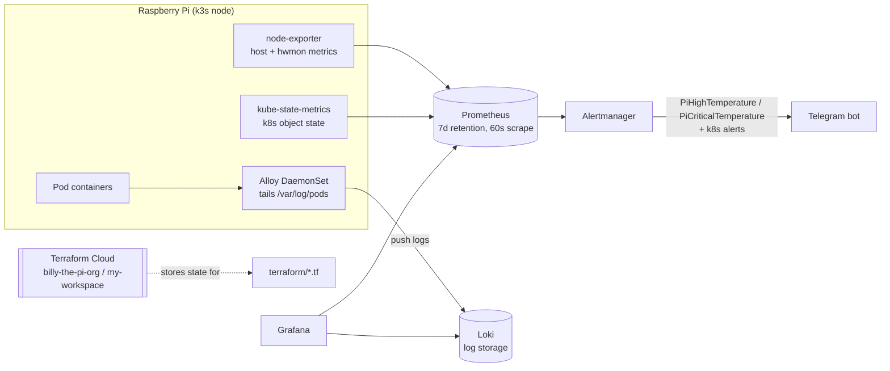

# k8s-pi-lab

Infrastructure for a Kubernetes home lab running on a single Raspberry Pi (k3s).

## Architecture

This repo is split into two layers that run in sequence, because Terraform's
`helm`/`kubernetes` providers only operate on a cluster that already exists
(via `~/.kube/config`) — they have no notion of the machine the cluster runs
on.

1. **`ansible/`** — bootstraps the k3s node itself, before a cluster exists.
   Installs k3s and keeps its bundled Traefik ingress controller disabled.
   Nothing in this cluster uses Traefik (no `Ingress`/`IngressRoute`
   resources), but its `LoadBalancer` service DNATs *all* inbound traffic on
   host ports 80/443 to itself via iptables, which silently broke Caddy
   (also running on this Pi, fronting unrelated services) until it was
   disabled.
2. **`terraform/`** — manages in-cluster resources once a kubeconfig exists:
   Helm releases for observability (`kube-prometheus-stack`, `loki`,
   `alloy`).

## Usage

### 1. Bootstrap k3s

Run once on a fresh Pi, or any time k3s needs to be reinstalled. Executed
from another machine on the same network with SSH access to the Pi and a
sudo-capable user:

```bash
ansible-playbook -i ansible/inventory.ini ansible/k3s.yml
```

### 2. Authenticate to Terraform Cloud

State is remote, so the CLI needs a user token before it can read or write it.
Tokens live in `~/.terraform.d/credentials.tfrc.json` (one entry per host,
mode `0600`) and are written there by:

```bash
terraform login
```

That opens `app.terraform.io/app/settings/tokens` in a browser; paste the
generated token back at the prompt. For a non-interactive shell, export
`TF_TOKEN_app_terraform_io` instead — it takes precedence over the file.

Tokens expire. A stale one shows up as `HTTP 401` on every command that
touches state, `terraform init` included; re-running `terraform login`
replaces it.

### 3. Deploy cluster resources

```bash
cd terraform
terraform init
terraform plan
terraform apply
```

`terraform.tfvars` is loaded automatically, so no `-var-file` is needed.

The workspace has to be in **Local** execution mode. The `helm` and
`kubernetes` providers reach the apiserver over the LAN via `~/.kube/config`,
so in Remote mode the run would execute on HashiCorp's infrastructure, which
has neither that kubeconfig nor a route to the Pi — and `terraform.tfvars` is
not uploaded to remote runs either, leaving the variables unset. Terraform
Cloud is used for state storage only.

## Observability



| Component | Chart | What it does |
|---|---|---|
| `kube-prometheus-stack` | `prometheus-community/kube-prometheus-stack` | Bundles Prometheus Operator, **Prometheus** (metrics TSDB), **Alertmanager** (routes alerts to Telegram), **Grafana** (dashboards), **node-exporter** (per-node host metrics, incl. temperature sensors), **kube-state-metrics** (k8s object state: pod/deployment/node status) |
| `loki` | `grafana/loki` | Log storage backend. Single-binary mode, filesystem storage, caches disabled — tuned to fit the Pi's 4 GB RAM |
| `alloy` | `grafana/alloy` | DaemonSet log shipper. Tails `/var/log/pods` on the node, parses CRI/Docker log framing, pushes to Loki |

Notes:
- **Temperature** comes from `node_hwmon_temp_celsius`, exported by node-exporter reading `/sys/class/hwmon` on the host. Alerted on by `PiHighTemperature`/`PiCriticalTemperature` in [`modules/observability/alerting-values.yaml`](terraform/modules/observability/alerting-values.yaml).
- **k3s false positives** (`KubeControllerManagerDown`, `KubeProxyDown`, `KubeSchedulerDown`, `Watchdog`) are routed to a `null` receiver — those components run embedded in the k3s binary rather than as separate scrapable pods, so Prometheus can never find them.
- **Terraform state** is remote, not local — stored in Terraform Cloud (org `billy-the-pi-org`, workspace `my-workspace`), see the `cloud` block in [`terraform/providers.tf`](terraform/providers.tf). Authentication is covered in [step 2](#2-authenticate-to-terraform-cloud).
- **Secrets** (Grafana admin password, Telegram bot token/chat ID) live in `terraform/terraform.tfvars`, which is gitignored; variable declarations are in [`terraform/variables.tf`](terraform/variables.tf).
